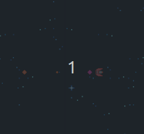
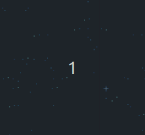
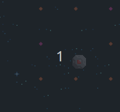
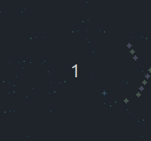

# HOWTO: Customize your game levels

Now that you've played our game, you might want to spice things up a bit and add new enemy patterns. Our project allows you to do so simply, and this guide will explain you how to do it.

## Understand the JSON file

In order to customize your game levels, you need to edit a JSON file. You can click [here](../assets/jsons/pattern_enemy_group.json) to be redirected to the file. As you can see, it is already filled with 9 different types of enemy waves. You can add a many waves as you want, but you need to respect the format of the file.

Each enemy wave is defined by a group of enemies. Each enemy has a `type` and a `positions` property:

- The `type` property defines which type of enemy you want to display on the screen.
- The `positions` property defines the positions of the enemies in the wave.

We will see next what are the different types of enemies and how to define their positions.

## Type property

We have 3 types of enemies in our game:

- `basic`: The basic enemy ship. It will move from left to right and shoot in front of him.
- `curve`: An enemy ship which moves from left to right as well as top to bottom. It will shoot at the player and do the same amount of damages as the `basic` enemy.
- `boss`: The boss enemy. It will move in circles and shoot in lines and diagonals. It has a lot of health points compared to the `basic` and `curve` enemies.

We also have a special type of entity to boost your player's stats: the `powerup`. It is a bonus that can be added to the wave to increase your player's stats. The stat modified is random. It ranges from leveling up, adding damages to your bullets, to increasing your speed.

Here is a preview of all enemies patterns in the game:

|   |
|:--:|
| *Basic and curve enemies* |

|   |
|:--:|
| *Boss enemy and Power up* |

Here is a recap of each enemy and their properties :
| Type        | Difficulty | Action
| ----------- | ---------- | ---------------------------------------------------------- |
| basic       | easy       | Moving left to right, shooting straight, low PV            |
| curve       | medium     | Moving in semi circle, shooting straight, low PV           |
| boss        | hard       | Moving in circle, shooting in 8 directions, high PV        |
| powerup     | bonus      | Boosts your stats, moving left to right                    |

## Positions property

The `positions` property is an array of two values: the `positionX` and the `positionY`. These values are the coordinates of the enemy on the screen. Some enemies will move from left to right, some will move from top to bottom, and some will move in circles. The `positionX` and `positionY` values will be used to define the starting position of the enemy.
The further the `positionX` value is, the later your enemy will be displayed on the screen. The further the `positionY` value is, the lower your enemy will be displayed on the screen.
Given the enemy you chose, some values must be respected:

| Type        | positionX   | positionY     |
| ----------- | ----------- | ------------- |
| basic       | x >= 255    | 0  < y < 239  |
| curve       | x >= 255    | 30 < y < 220  |
| boss        | x >= 255    | 50 < y < 230  |
| powerup     | x >= 255    | 0  < y < 239  |

As you can see, the `positionX` value must be greater or equal to 255. This is because the enemies will spawn on the right side of the screen, and the screen is 255 pixels wide. This way enemies will have to cross the entire screen, allowing the player to have enough time to kill them. The further the `positionX` value is, the later your enemy will be displayed on the screen.

Depending on the enemy, their `positionY` possible values vary. This is due to the fact that some enemies, like the boss for example will move in circles. If the `positionY` value is too low or high, the enemy will be displayed too far on the top/bottom of the screen and will partially disappear. These values also take in consideration the size of the enemy. For example, the boss is 64 pixels high, so the `positionY` value must be greater than 50 and lower than 230 to be displayed correctly.

## How to add a new wave

Now that we've seen how to set our enemies's properties, let's add a new wave to the game.

First, you need to understand the format of our JSON file.
Each wave is defined as is:

```json
{
    [
        {
            "type" : "[chosen type]",
            "positions" : [positionX, positionY]
        }
    ]
}
```

In this example, you created a wave with only one enemy in it. Each enemy has a `type` and a `positions` property.
This example will of course not work because it is not composed of the correct values.

If you want to add more enemies to the wave, you can simply add more objects to the array:

```json
{
    // Wave 1
    [
        // enemy 1
        {
            "type" : "[chosen type]",
            "positions" : [positionX, positionY]
        },
        // enemy 2
        {
            "type" : "[chosen type]",
            "positions" : [positionX, positionY]
        }
    ]
}
```

As you can see, the wave is contained between the square brackets. Each enemy is defined by an object, which is contained between the curly brackets.

## Reminders

- Between each enemy and each wave, you need to add a comma.
- Between each property of the enemy, you need to add a comma as well.
- Be careful ! the last enemy of the wave must not have a comma after it, and the last wave must not have a comma after it.
- The `type` property must be one of the following: `basic`, `curve`, `boss`, `powerup`
- You can add as many enemies as you want in a wave, and as many waves as you want, but you need to respect the format of the file.
- Don't forget to recompile the game after you've edited the JSON file for the changes to take effect!

If you followed this guide correctly, you should be able to add new waves to the game. Have fun and good luck !
