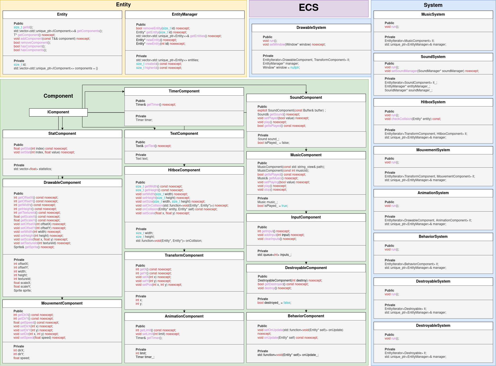
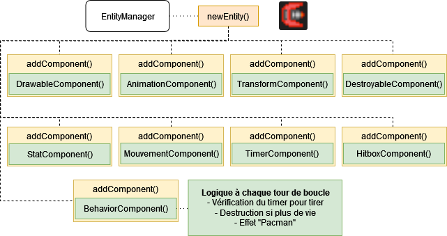

# ECS structure graph

This graph explains in details how our ECS implementation is structured.

We have 2 main classes, that will respectively allow to define the general entities and components's attributes and behaviors.
- The `Entity` class is responsible for creating, updating and deleting entities.
- The `IComponent` class allows us to handle all our components in a generic manner. It is the base class of all components. All entities will be composed of components heriting from this interface.

For the systems, each system will be defined in a separate class but all will have at least two attributes:
- An entity iterator, that will allow us to iterate over all the entities that have the components that the system needs.
- A pointer to the `EntityManager` class, that will allow us to create, update and delete entities.

For example, in the `MusicSystem` class, which handles all our musics in the game, we will have in attributes:
```cpp
    EntityIterator<MusicComponent> it_;
    EntityManager*                 manager_;
```

## Graph:


# ECS Entity graph

This graph explains in details how an entity is structured and updated/

